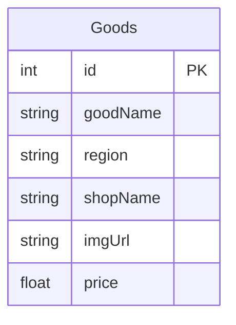
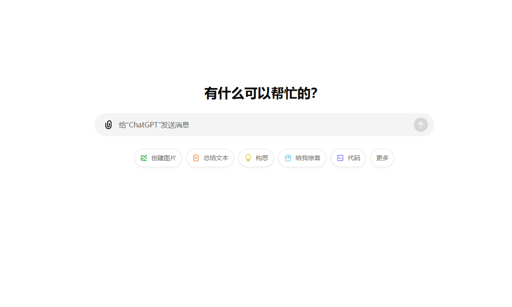
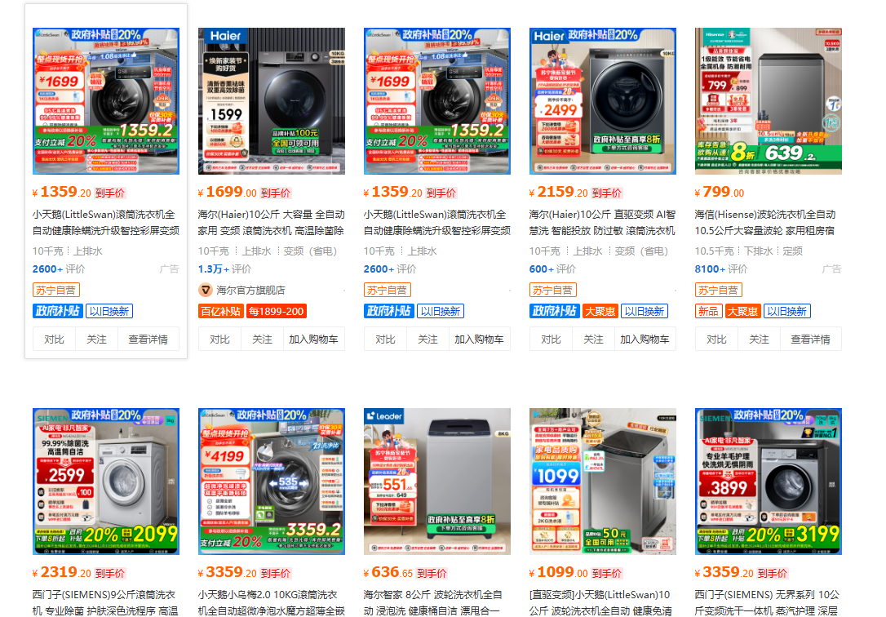

# Design

## 0 Purpose

> This is the English version of the demand in assignment

The basic functions that need to be implemented are as follows: 

1. Build a website that can provide users a interface to check the price of goods.
2. Build a website that show the data of goods. It can be in the same page of 1.
3. Enhancements: The style is adapted to the mobile phone and can be displayed friendly in the built-in browser of mobile browsers/WeChat and other applications. 


## 1 Demand Analysis

The purpose can be divided into two parts:

1. A **backend server** which include a web crawler to get data from major shopping websites.
	example websites:
	* Taobao
	* JingDong
	* PinDuoDuo
	* XianYu
	* DangDang
	* SuNing
	all these websites can be crawled without any verification.

2. A **frontend website** to enter the target and to show the data of goods.

### Backend Server

The backend server is for crawling data from major shopping websites. It should be implemented by a python web crawler.

It can be seperated into several parts:

1. **Data crawler**: It can be implemented by python. It can be used to crawl data from the major shopping websites. It can be used to crawl data from different websites at the same time.

2. **Data sorter**: sort the data by price.

3. **Data Receiver & Sender**:It can receive the information from the frontend and sent data back.

### Frontend website

The frontend website is for showing the message we have crawled.


## 2 Data model




## 3 API design

To better show information, define some items

All response are in below format

```json
{
    'code': Integer,
    'message': String,
    'goodData': Any
}
```

we have only one api which is `/search`.

the type of the api is `POST`. The request body is json.

the request body is:

```json
{
	'keyword': String,
	'websites': List[String]
}
```

The response body is:

```json
{
	'code': Integer,
	'message': String,
	'goodData': List[Goods]
}
```

We need to mention that, "Goods" is the data we crawled, and it include `id`, `goodName`, `region`, `shopName`, `imgUrl`, `price`, etc.  


<!--
So below api map only show what in data field

Also, use `user` as a struct of user item, `device` as a struct of device item and `data` as a struct of data item (items definition can be seen above) for short. And `need-token` means the api requires a token generate by login.

### User

> Parent path: `\user`

| Path         | Type | `need-token` | Request                         | Response     |
| ------------ | ---- | ------------ | ------------------------------- | ------------ |
| add          | POST | yes          | `user`                          | `user`       |
| delete/{uid} | POST | yes          |                                 |              |
| info         | GET  | yes          |                                 | `user`       |
| list         | GET  | yes          |                                 | `list[user]` |
| login        | GET  | no           |                                 | `user`       |
| login        | POST | no           | `user.username`&`user.password` | `user`       |
| logout       | GET  | no           |                                 |              |
| update       | POST | yes          |                                 | `user`       |

### Device

> Parent path: `\device`

| Path         | Type | `need-token` | Request  | Response       |
| ------------ | ---- | ------------ | -------- | -------------- |
| add          | POST | yes          | `device` | `device`       |
| data/{did}   | GET  | yes          |          | `list[data]`   |
| delete/{did} | POST | yes          |          | `device`       |
| info/{did}   | GET  | yes          |          | `device`       |
| list         | GET  | yes          |          | `list[device]` |
| update/{did} | POST | yes          | `device` | `device`       |

### Data

> Parent path: `\device`
>
> The same parent path to reduce path branch

| Path         | Type | `need-token` | Request        | Response      |
| ------------ | ---- | ------------ | -------------- | ------------- |
| dataList     | POST | yes          | `selectOption` | `list[data]`  |
| dataYearLsit | GET  | no           |                | `list[years]` |
>
 
<!--
## 4 Demo show


-->

## 4 Page Design

> We can draw inspiration from ChatGPT's home page design.



One line for **introduction**. Like slogan, etc.

One line for **Search bar**.

One line for **Selection box**. It can be used to select the websites we want to check.

After searching, the results will be shown by several cards in a row, like this:



Well, the card can be designed better.